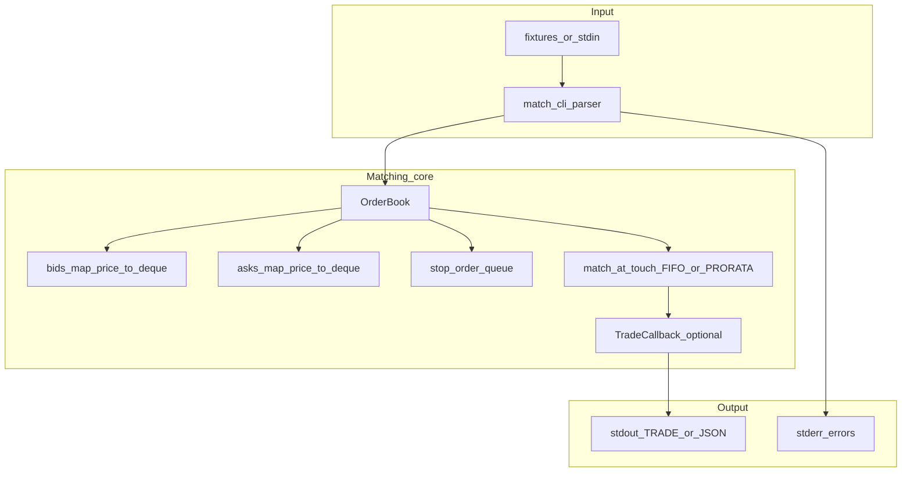

# HighFreqOrderMatching

**A fast, readable C++17 limit-order book with FIFO or pro-rata matching, plus a replay CLI for research and testing.**

[](https://github.com/sriaratragada/HighFreqOrderMatching/actions/workflows/ci.yml)
[](LICENSE)
[](https://en.cppreference.com/w/cpp/17)

---

## Features

- **Limit, market, and stop orders** with explicit price-time queues per level (`std::deque`).
- **Two allocation modes at the inside market:** strict **FIFO** or **PRORATA** (largest-remainder split, greedy pairing for fill reporting).
- **Trade callbacks** for embedding (`std::function`); CLI prints human **text** or **JSON lines**.
- **Duplicate order ID protection** for active resting and stop-queue orders.
- **`match_cli`** for scripting: `--file` / stdin, `#` comments, `CANCEL`, `--version`, `--json`.
- **CMake install** as **`HighFreqOrderMatching::hfom_orderbook`** with package config for `find_package`.
- **Cross-platform CI** (Ubuntu + macOS) building Release and running **GoogleTest**.

---

## Architecture

| Layer | Role |
|--------|------|
| **Order book core** | Maintains sorted bid/ask maps (`price → deque<Order>`), executes matching loops, stop activation, optional trade sink. |
| **CLI** | Line-oriented grammar → `Order` structs → `OrderBook`; formats trades to stdout/stderr. |
| **Tests** | Unit tests for crosses, partials, market peg, stops, pro-rata conservation, duplicates. |
| **Build** | CMake 3.16+, C++17; optional `FetchContent` for GoogleTest when `BUILD_HFOM_TESTS=ON`. |

**Design choices**

- Single-symbol, **single-threaded** logical book (no locks in the core); safe to run one `OrderBook` per thread or external shard by symbol.
- **Prices** as `double`, **quantities** as `int` (documented semantics); easy to swap for fixed-point in a fork.

---

## Data flow diagram



---

## Requirements

| Tool | Version |
|------|---------|
| CMake | 3.16+ |
| Compiler | C++17 (GCC 9+, Clang 10+, MSVC 2019+) |

CI runs on **ubuntu-latest** and **macos-latest** with a **Release** build and **ctest**.

---

## Quick start

```bash
git clone https://github.com/sriaratragada/HighFreqOrderMatching.git
cd HighFreqOrderMatching
cmake -S . -B build -DCMAKE_BUILD_TYPE=Release
cmake --build build
ctest --test-dir build --output-on-failure
./build/match_cli --file fixtures/sample.txt
```

**Embed the library**

```bash
cmake --install build --prefix /usr/local
```

```cmake
find_package(HighFreqOrderMatching 1.0 CONFIG REQUIRED)
target_link_libraries(my_target PRIVATE HighFreqOrderMatching::hfom_orderbook)
```

The imported target exposes `orderbook.h` and `hfom/version.hpp` (`HFOM_VERSION_STRING`).

---

## CLI reference

| Flag | Meaning |
|------|---------|
| `--file PATH` | Read commands from file (default: stdin) |
| `--allocation FIFO \| PRORATA` | Matching at the touch |
| `--json` | One JSON object per fill |
| `--version` | Print version string |
| `-h`, `--help` | Usage |

**Commands** (one per line)

- `ADD BUY|SELL LIMIT <id> <price> <qty>`
- `ADD BUY|SELL MARKET <id> <qty>`
- `ADD BUY|SELL STOP <id> <stop_price> <qty>`
- `CANCEL <id>`

Example text output: `TRADE <qty> <price> <bid_order_id> <ask_order_id>`

---

## Matching semantics (summary)

- **FIFO:** best bid vs best ask while the spread is crossed; FIFO within each price level.
- **PRORATA:** match `min(totalBidQty, totalAskQty)` at the touch; proportional allocation on each side, then greedy pairing for reported fills.
- **Market orders** peg to the opposite side’s **best price at entry**, or to a sentinel (`±inf` / `lowest`) when that side is empty—see [fixtures/sample.txt](fixtures/sample.txt) for multi-level sweep patterns.
- **Stops:** buy stop activates when `stopPrice <= lowestAsk()`; sell stop when `stopPrice >= highestBid()`. On an empty opposite side, sentinels can trigger **immediately** for finite stops—documented for reproducibility.

Full detail lives in the **CLI reference** and source: [src/orderbook.cpp](src/orderbook.cpp).

---

## Testing and CI

- Tests live under [tests/](tests/). Enable with **`BUILD_HFOM_TESTS=ON`** (default **on** when this tree is the CMake root; **off** when used as a subdirectory unless you set the option).
- Workflow: [.github/workflows/ci.yml](.github/workflows/ci.yml).

---

## Contributing

See [CONTRIBUTING.md](CONTRIBUTING.md). PRs should keep tests green and update [CHANGELOG.md](CHANGELOG.md) when behavior changes.

---

## License

[MIT License](LICENSE).

---

## Maintainer

**[Sri Atragada](https://github.com/sriaratragada)** · [github.com/sriaratragada](https://github.com/sriaratragada)
