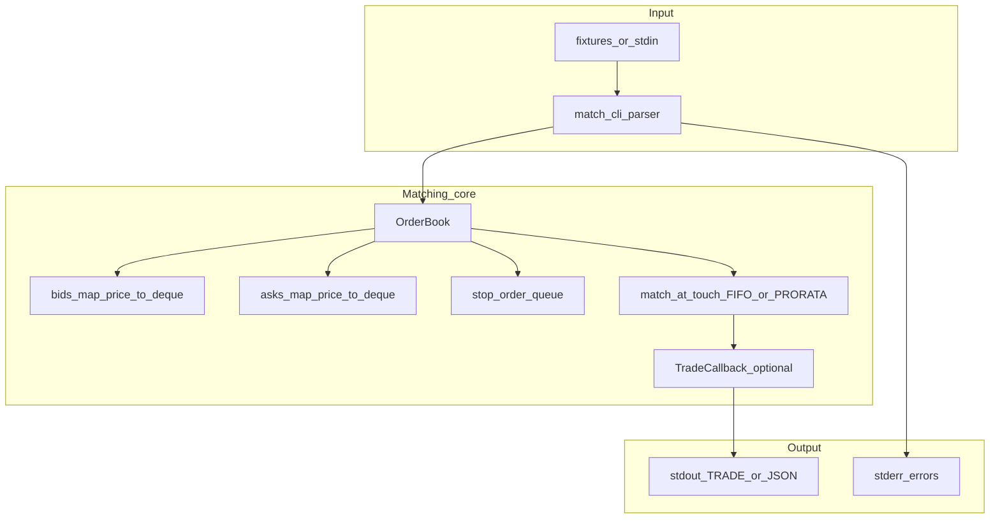

# HighFreqOrderMatching

**A fast, readable C++17 limit-order book with FIFO or pro-rata matching, plus a replay CLI for research and testing.**

In plain terms: it matches **buy** and **sell** instructions for a **single** instrument—pairing them when prices **cross**—and can require orders to behave like **“trade only what you can right now”** (**IOC**: drop any leftover) or **“trade the full size right now or cancel the whole order”** (**FOK**). You can also **print** a quick snapshot of **how much** is waiting to buy or sell at each **price** (`BOOK` or `--dump-book`).

[](LICENSE)
[](https://en.cppreference.com/w/cpp/17)

---

## Features

- **Limit, market, and stop orders** with explicit price-time queues per level (`std::deque`).
- **Two allocation modes at the inside market:** strict **FIFO** or **PRORATA** (largest-remainder split, greedy pairing for fill reporting).
- **Trade callbacks** for embedding (`std::function`); CLI prints human **text** or **JSON lines**.
- **Duplicate order ID protection** for active resting and stop-queue orders.
- **Time in force:** **GTC** (default—rest any remainder), **IOC** (match now, cancel remainder), **FOK** (fill entire size immediately or reject).
- **Book depth:** `BOOK [depth]` in replays; **`--dump-book`** / **`--dump-depth`** after stdin ends.
- **Per-`OrderBook` order-id sequence** when using auto ids (`orderId < 0`).
- **CMake install** as **`HighFreqOrderMatching::hfom_orderbook`** with package config for `find_package`.
- **Unit tests** via GoogleTest (optional fetch when `BUILD_HFOM_TESTS=ON`).

---

## Architecture

| Layer | Role |
|--------|------|
| **Order book core** | Maintains sorted bid/ask maps (`price → deque<Order>`), executes matching loops, stop activation, optional trade sink. |
| **CLI** | Line-oriented grammar → `Order` structs → `OrderBook`; formats trades to stdout/stderr. |
| **Tests** | Unit tests for crosses, partials, market peg, stops, pro-rata conservation, duplicates. |
| **Build** | CMake 3.16+, C++17; optional `FetchContent` for GoogleTest when `BUILD_HFOM_TESTS=ON`. |

**Design choices**

- Single-symbol, **single-threaded** logical book (no locks in the core); safe to run one `OrderBook` per thread or external shard by symbol.
- **Prices** as `double`, **quantities** as `int` (documented semantics); easy to swap for fixed-point in a fork.

---

## Data flow diagram



---

## Requirements

| Tool | Version |
|------|---------|
| CMake | 3.16+ |
| Compiler | C++17 (GCC 9+, Clang 10+, MSVC 2019+) |

---

## Build locally

From the project root:

```bash
cmake -S . -B build -DCMAKE_BUILD_TYPE=Release
cmake --build build
ctest --test-dir build --output-on-failure
./build/match_cli --file fixtures/sample.txt
```

When embedding this project with `add_subdirectory`, tests default **off** unless you set `BUILD_HFOM_TESTS=ON` in the parent project.

**Install the library** (optional):

```bash
cmake --install build --prefix /usr/local
```

```cmake
find_package(HighFreqOrderMatching 1.1 CONFIG REQUIRED)
target_link_libraries(my_target PRIVATE HighFreqOrderMatching::hfom_orderbook)
```

The imported target exposes `orderbook.h` and `hfom/version.hpp` (`HFOM_VERSION_STRING`).

---

## CLI reference

| Flag | Meaning |
|------|---------|
| `--file PATH` | Read commands from file (default: stdin) |
| `--allocation FIFO \| PRORATA` | Matching at the touch |
| `--json` | One JSON object per fill |
| `--version` | Print version string |
| `--dump-book` | After input ends, print aggregated bid/ask depth (`--dump-depth` controls how many levels) |
| `--dump-depth N` | With `--dump-book`, number of price levels per side (default 10) |
| `-h`, `--help` | Usage |

**Commands** (one per line)

- `ADD BUY|SELL LIMIT [GTC \| IOC \| FOK] <id> <price> <qty>` — omit TIF for **GTC**
- `ADD BUY|SELL MARKET [GTC \| IOC \| FOK] <id> <qty>`
- `ADD BUY|SELL STOP [GTC \| IOC \| FOK] <id> <stop_price> <qty>`
- `CANCEL <id>`
- `BOOK [depth]` — print top **depth** price levels per side (default 10)

Example text output: `TRADE <qty> <price> <bid_order_id> <ask_order_id>`

---

## Matching semantics (summary)

- **FIFO:** best bid vs best ask while the spread is crossed; FIFO within each price level.
- **Time in force:** **IOC** removes any resting remainder after matching. **FOK** requires that the full size can be taken from the opposite book **before** the order rests (limit: liquidity at or inside limit; market: total opposite size). If not, the order is rejected and the book is unchanged.
- **PRORATA:** match `min(totalBidQty, totalAskQty)` at the touch; proportional allocation on each side, then greedy pairing for reported fills.
- **Market orders** peg to the opposite side’s **best price at entry**, or to a sentinel (`±inf` / `lowest`) when that side is empty—see [fixtures/sample.txt](fixtures/sample.txt) for multi-level sweep patterns.
- **Stops:** buy stop activates when `stopPrice <= lowestAsk()`; sell stop when `stopPrice >= highestBid()`. On an empty opposite side, sentinels can trigger **immediately** for finite stops—documented for reproducibility.

Full detail is in the source: [src/orderbook.cpp](src/orderbook.cpp).

---

## Continuous integration

If you use GitHub, [.github/workflows/ci.yml](.github/workflows/ci.yml) configures and builds **Release** and runs **ctest** on Ubuntu and macOS runners. The project does not depend on that for a local build.

---

## Contributing

See [CONTRIBUTING.md](CONTRIBUTING.md). Keep changes focused; update [CHANGELOG.md](CHANGELOG.md) when behavior changes.

---

## License

[MIT License](LICENSE).
